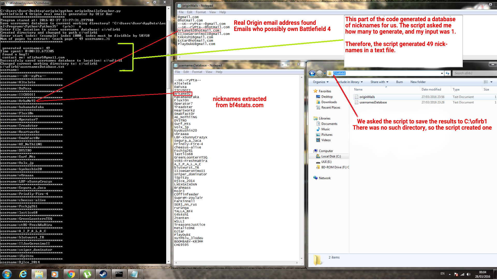

# Origin Emails Cracker

## Abstract
Origin is a company selling video games, similar to Steam. You can browse and purchase different
video games. Popular games include "Battlefield 4", and many more.
In Battlefield 4, every user has a nickname.

## Script in a nutshell
The script target is to find real Origin accounts e-mails and write it to a local DB. </br>
It is likely that these accounts purchased Battlefield 4. </br>
The script is written in python and uses selenium to automate tasks. </br>

## Assumptions
I assume that inside a big database of nicknames of users who play Battlefield 4,
there will be a percentage of users that their email address wil be the same as their nickname</br>

Example: I have Origin account and I purchased "Battlefield 4". my in-game nickname is "hatzil".
Therefore, I assume it is possible that the user email address will be "hatzil@gmail.com", "hatzil@hotmail.com" or similar.
</br>
Assuming, that "hatzil@gmail.com" is an Origin-related email address for an account that owns Battlefield 4, The script needs a way to differntiate it from emails that are not registered in Origin.

## How the script works
First, the script needs a database of user profile names.
* The script goes to "bf4stats.com" which is a website hosting user ranking for "Battlefield 4" </br>
Inside the website, there are the in-game names for players playing "Battlefield 4" - a game purchasable only in Origin. </br>
* The script extract only the usernames, and store it to a local text file. The amount of usernames extracted depends on how much you ask the script to extract. You will be promoted to enter a number, 1 = 49 usernames, 2 = 98 usernames, etc.
You can save it to whatever path you'd like. Please note that the more users you extract the more time it will take to generate a database, so the more time it will take the script to start validating e-mail addresses.
* The script reads the created database of users. It then goes to Origin website and tries to register a new Account.
for each username in the local text file DB, it adds "@gmail.com", "@hotmail.com", etc.

There are 2 states:
If Origin allows to create an account - there is no such username, therefore it is useless.
If Origin says account can't be created because email is already in-use - it is highly probable that this email account belongs to this user, and therefore this email own "Battlefield 4". Therefore the script output that to a local text file.

Example:
Battlefield username: ofir1997

Script will try to register the following email addresses:
ofir1997@gmail.com
ofir1997@hotmail.com
ofir1997@yahoo.com

The script found that ofir1997@hotmail.com is registered in origin, therefore it is written to a local database.

## Screenshots


## Dependencies 
You must have Python 3.x , selenium , and chromewebdriver.exe in order for the script to work.

Note:
To install selenium, use:
```pip install -U selenium```

If you don't have chromewebdriver.exe, the script will download it, and find its path automatically.
If you experience any issues with that, just manually download chromewebdriver.exe

# License
```
Copyright 2016-2018 Ofir Bar

Licensed under the Apache License, Version 2.0 (the "License");
you may not use this file except in compliance with the License.
You may obtain a copy of the License at

    http://www.apache.org/licenses/LICENSE-2.0

Unless required by applicable law or agreed to in writing, software
distributed under the License is distributed on an "AS IS" BASIS,
WITHOUT WARRANTIES OR CONDITIONS OF ANY KIND, either express or implied.
See the License for the specific language governing permissions and
limitations under the License.
```


